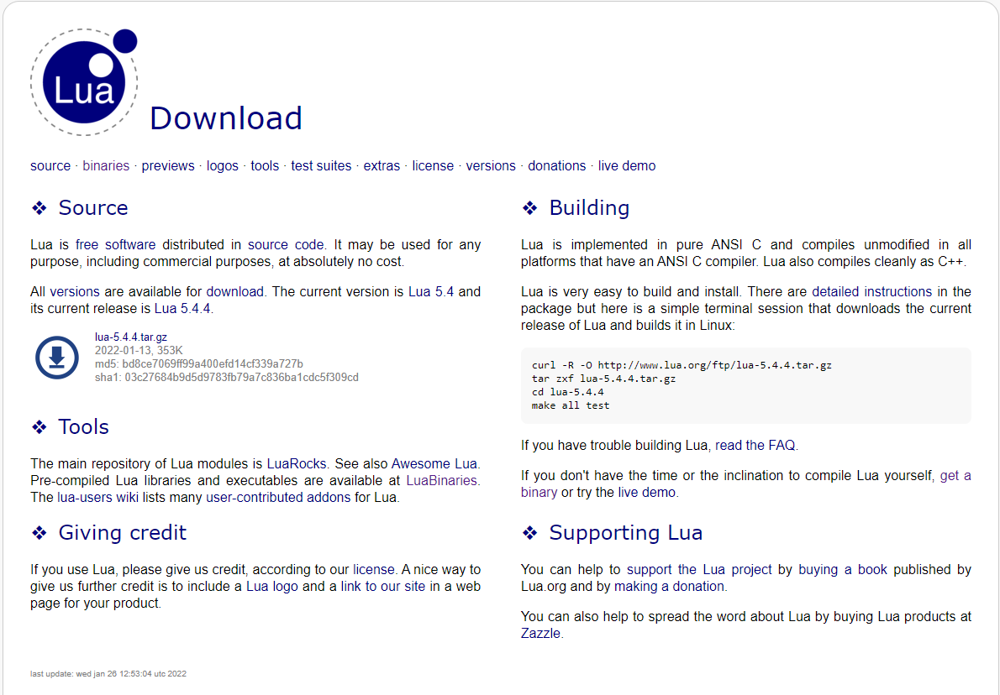
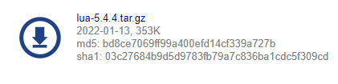

# Lua

Uma linguagem de programação interpretada, de script de alto nivel, com tipoagem dinâmica e multiparadigma. 
Projetada por Tecgraf da PUC-Rio em 1993.
Os ficheiros terminam com a extensão .lua
Continua a ser adaptada, a sua ultima atualização foi a versão 5.4.4 a 26 de janeiro de 2022(data da criação de ficheiro: 03-07-2022).

## Como compilar ficheiros .lua

Para poder ver o resultado dos seus ficheiros .lua deve instalar o compilador.
para isso deve aceder a [lua.org/download.html](https://www.lua.org/download.html) e instalar o ficheiro.





A instalação não tem nada que saber, apenas espere até o link do download esteja disponível e instale.

Após a instalação, coloque os ficheiros para a pasta do seu projeto.

Para a compilação dos seus ficheiros abra a pasta no terminal, execute a linha de código:

```
lua54.exe ex1.lua
```

ou seja, nome fo exe da versão do compilador(neste caso é a versão 54) seguido do nome do ficheiro que quer compilar.


## Hello word

Como uma boa tradição começamos com o famoso "Helo word".
Assim como em muitas linguagens de programação, para visualizar um texto usa-se o comando _print()_

``` print("Olá mundo")  ```

#### [ex.1](https://github.com/jssicapedro/estudo_lua/blob/main/ex1-hello.lua)